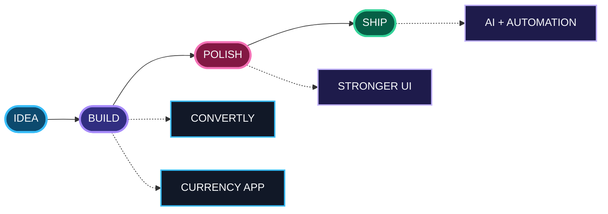

<picture>
  <source media="(prefers-color-scheme: dark)" srcset="dark.svg">
  <source media="(prefers-color-scheme: light)" srcset="light.svg">
  
</picture>
 
 

welcome to my little corner of GitHub

## GitHub Pulse

<picture>
  <source media="(prefers-color-scheme: dark)" srcset="https://raw.githubusercontent.com/alebaqinduni/alebaqinduni/output/stats-dark.svg?v=20260826">
  <source media="(prefers-color-scheme: light)" srcset="https://raw.githubusercontent.com/alebaqinduni/alebaqinduni/output/stats-light.svg?v=20260826">
  
</picture>
  

## Contribution Garden

<picture>
  <source media="(prefers-color-scheme: dark)" srcset="https://raw.githubusercontent.com/alebaqinduni/alebaqinduni/output/contribution-graph-dark.svg?v=20260826">
  <source media="(prefers-color-scheme: light)" srcset="https://raw.githubusercontent.com/alebaqinduni/alebaqinduni/output/contribution-graph-light.svg?v=20260826">
  
</picture>
 
the garden grows when there is something new to show

## What I Am Building

<table width="100%">
<tr>
<td width="50%" valign="top" align="center">
 
<strong>CONVERTLY</strong>  

  
A conversion-focused web project with a clean, practical interface.
  

  
</td>
<td width="50%" valign="top" align="center">
 
<strong>CURRENCY APP</strong>  

  
A currency conversion project focused on exchange-rate utilities and a practical user experience.
  

  
</td>
</tr>
</table>

## Project Roadmap

the route from an idea to the next release

<table width="94%">
<tr>
<td align="center" width="25%">01 <strong>IDEA</strong> spot a useful problem</td>
<td align="center" width="25%">02 <strong>BUILD</strong> make the first real version</td>
<td align="center" width="25%">03 <strong>POLISH</strong> clarity, motion, detail</td>
<td align="center" width="25%">04 <strong>SHIP</strong> learn and iterate</td>
</tr>
</table>

## Current Focus

<table width="94%">
<tr>
<td width="24%" align="center" valign="middle">

  <strong>BUILD MODE</strong>
 what is getting attention now
</td>
<td width="19%" align="center"><strong>WEB</strong>   useful apps</td>
<td width="19%" align="center"><strong>CODE</strong>   Python · C++ · JS</td>
<td width="19%" align="center"><strong>AI</strong>   experiment</td>
<td width="19%" align="center"><strong>UI</strong>   motion · clarity</td>
</tr>
</table>
 
<table width="88%">
<tr>
<td align="center">WEB <strong>BUILD → TEST → IMPROVE</strong></td>
<td align="center">CODE <strong>LEARN → PRACTICE → SHIP</strong></td>
<td align="center">AI <strong>EXPLORE → PROTOTYPE</strong></td>
<td align="center">UI <strong>DESIGN → POLISH</strong></td>
</tr>
</table>

## Education

<table width="92%">
<tr>
<td width="18%" align="center" valign="middle">

  THE START
</td>
<td width="4%" align="center"><strong>→</strong></td>
<td width="34%" align="center" valign="middle">

  <strong>University of Engineering and Technology, Lahore</strong>
 learning the foundations of computing
</td>
<td width="4%" align="center"><strong>→</strong></td>
<td width="18%" align="center" valign="middle">

  LEARN BY MAKING
</td>
<td width="4%" align="center"><strong>→</strong></td>
<td width="18%" align="center" valign="middle">

  STILL EXPLORING
</td>
</tr>
</table>
 
<table width="80%">
<tr>
<td align="center"><strong>LEARN</strong> concepts</td>
<td align="center">+</td>
<td align="center"><strong>BUILD</strong> projects</td>
<td align="center">+</td>
<td align="center"><strong>CREATE</strong> experiments</td>
<td align="center">+</td>
<td align="center"><strong>EXPLORE</strong> what comes next</td>
</tr>
</table>

## About Me

<table width="92%">
<tr>
<td width="24%" align="center" valign="middle">

  
CS STUDENT · DEVELOPER
</td>
<td width="76%" align="left" valign="middle">
<strong>Curious builder who likes turning small ideas into useful things.</strong>
  
I learn by building — experimenting with code, exploring new technologies, and improving the details that make an application feel polished.
  

</td>
</tr>
</table>

## Tech Stack
### Languages

### Frontend

### Backend & Data

### Tools & Deployment

## Connect

  

 
building quietly, learning constantly, and keeping things a little bit pretty.
  
Thanks for hopping by.

