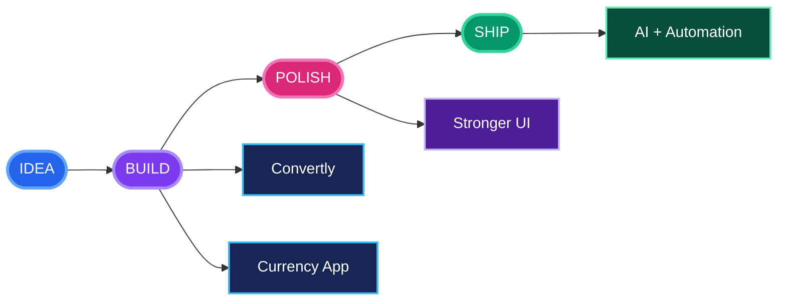
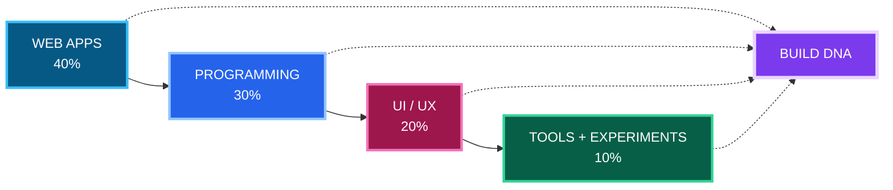
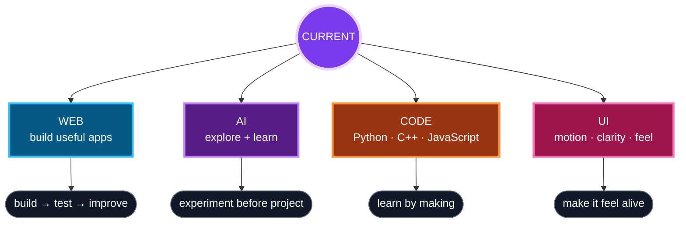
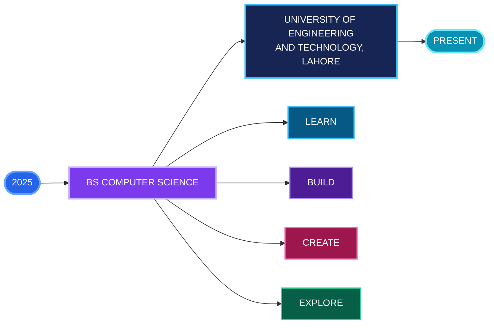

<picture>
  <source media="(prefers-color-scheme: dark)" srcset="dark.svg">
  <source media="(prefers-color-scheme: light)" srcset="light.svg">
  
</picture>
 
 

welcome to my little corner of GitHub

## GitHub Statistics

<picture>
  <source media="(prefers-color-scheme: dark)" srcset="https://raw.githubusercontent.com/alebaqinduni/alebaqinduni/output/stats-dark.svg?v=20260826">
  <source media="(prefers-color-scheme: light)" srcset="https://raw.githubusercontent.com/alebaqinduni/alebaqinduni/output/stats-light.svg?v=20260826">
  
</picture>
  

## Contribution Garden

<picture>
  <source media="(prefers-color-scheme: dark)" srcset="https://raw.githubusercontent.com/alebaqinduni/alebaqinduni/output/contribution-graph-dark.svg?v=20260826">
  <source media="(prefers-color-scheme: light)" srcset="https://raw.githubusercontent.com/alebaqinduni/alebaqinduni/output/contribution-graph-light.svg?v=20260826">
  
</picture>
 
the garden grows when there is something new to show

## Activity Graph

## Achievements

 
<table width="92%">
<tr>
<td align="center" width="25%">REPOSITORIES  <strong>3</strong> public</td>
<td align="center" width="25%">STARS  <strong>0</strong> stars</td>
<td align="center" width="25%">CONTRIBUTIONS  <strong>138</strong> past year</td>
<td align="center" width="25%">FOLLOWERS  <strong>3</strong> followers</td>
</tr>
</table>
 

## Project System

<table width="100%">
<tr>
<td width="33%" valign="top">
### CONVERTLY

A conversion-focused web project with a clean, practical interface.

</td>
<td width="33%" valign="top">
### CURRENCY APP

A currency conversion project focused on exchange-rate utilities and a practical user experience.

</td>
<td width="34%" valign="top">
### BUILD DIRECTION

**NOW** · practical web applications  
**NEXT** · stronger interfaces and useful tools  
**EXPLORE** · AI, automation and new technologies

`IDEATE` → `DESIGN` → `CODE` → `POLISH`
</td>
</tr>
</table>

## PROJECT ROADMAP

<table width="96%">
<tr>
<td align="center" width="25%">01 · LIVE  <strong>CONVERTLY</strong> small idea → useful app</td>
<td align="center" width="25%">02 · LIVE  <strong>CURRENCY APP</strong> simple → practical</td>
<td align="center" width="25%">03 · NEXT  <strong>STRONGER UI</strong> motion → clarity → polish</td>
<td align="center" width="25%">04 · EXPLORE  <strong>AI + AUTOMATION</strong> learn → experiment → build</td>
</tr>
</table>

## PROJECT OVERVIEW

<table width="90%">
<tr>
<td align="center"><strong>40%</strong> WEB</td>
<td align="center"><strong>30%</strong> CODE</td>
<td align="center"><strong>20%</strong> UI / UX</td>
<td align="center"><strong>10%</strong> TOOLS</td>
</tr>
</table>
 
visual composition of the profile direction, not repository statistics

## CURRENT FOCUS

---

## EDUCATION

<table width="92%">
<tr>
<td align="center" width="25%"><strong>2025</strong> START</td>
<td align="center" width="25%"><strong>BS COMPUTER SCIENCE</strong> FOUNDATIONS</td>
<td align="center" width="25%"><strong>2025 — PRESENT</strong> LEARNING BY BUILDING</td>
<td align="center" width="25%"><strong>UET LAHORE</strong> IN PROGRESS</td>
</tr>
</table>
 
learn → build → create → explore

---

## About Me

<table width="92%">
<tr>
<td width="22%" align="center" valign="middle">

  

</td>
<td width="78%" align="left" valign="middle">
<strong>Computer Science student · developer · curious builder</strong>
  
I like taking a small idea, giving it a clear purpose, and turning it into something people can actually use. I learn by building — experimenting with code, exploring new technologies, and improving the details that make an application feel polished.
  

</td>
</tr>
</table>
 

---

## Tech Stack
### Languages

### Frontend

### Backend & Data

### Tools & Deployment

---

## Projects

&nbsp;

---

## Connect with Me

  

 
building quietly, learning constantly, and keeping things a little bit pretty.
  
Thanks for hopping by.

