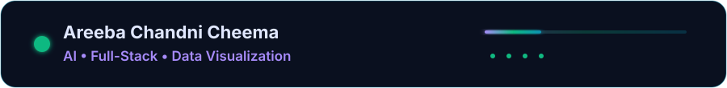

**Areeba Chandni Cheema** | AI-Focused Developer | Lahore, Pakistan

---

##  Profile Banner 🎨

<picture>
  <source media="(prefers-color-scheme: dark)" srcset="dark.svg">
  <source media="(prefers-color-scheme: light)" srcset="light.svg">
  
</picture>

 

 
---

##  GitHub Statistics 📊

<picture>
  <source media="(prefers-color-scheme: dark)" srcset="stats-dark.svg">
  <source media="(prefers-color-scheme: light)" srcset="stats-light.svg">
  
</picture>

 

---

##  Contribution Graph 🐍

<picture>
  <source media="(prefers-color-scheme: dark)" srcset="https://raw.githubusercontent.com/alebaqinduni/alebaqinduni/output/snake-dark.svg">
  <source media="(prefers-color-scheme: light)" srcset="https://raw.githubusercontent.com/alebaqinduni/alebaqinduni/output/snake.svg">
  
</picture>

 

 
---

##  Activity Graph 📈

---

##  GitHub Achievements 🏆

---

##  Connect with Me 🔗

 

---

##  Tech Stack 🛠️

### Core Languages

### Frontend

### Backend

### Database

### Infrastructure

---

##  Featured Projects 📚

### 💱 Lahore Exchange — Currency Board
A full-stack currency converter with a static frontend and Express API backend.

**Features:**
- Live exchange rates with public API
- Express backend with rate caching
- PWA support for mobile installation
- Service worker for offline functionality
- Deploy-ready on Vercel, Render, or Railway

**Tech:** HTML, CSS, JavaScript, Express.js, Node.js  
**Status:** Deploy-ready

[View Project →](https://github.com/alebaqinduni/projects/tree/main/currency-app)

---

##  Education 🎓

**BS Computer Science**  
University of Engineering and Technology, Lahore  
*2025 - Present*

---

##  About Me 📝

I'm passionate about AI-focused development and building scalable solutions. Currently studying computer science while contributing to open-source projects and developing full-stack applications. I love experimenting with new technologies and sharing my learning journey with the community. I like turning messy data into working intelligence.

**Current Focus:**
-  AI/ML-driven projects
-  Full-stack web development
-  Data visualization and analytics
-  Open-source contributions

---

##  Latest Activity 📈

Check out my contributions above! 

---

**Thanks for visiting!** Feel free to reach out via the links above. 💚

Last updated: August 25, 2026
