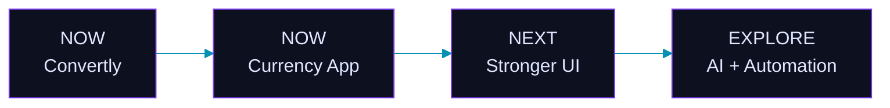

## Profile Banner

<picture>
  <source media="(prefers-color-scheme: dark)" srcset="dark.svg">
  <source media="(prefers-color-scheme: light)" srcset="light.svg">
  
</picture>

<!-- Small animated idea line: directly on the banner, before the wave -->

<!-- Soft purple wave: replaces the old blue line -->

૮ ˶ᵔ ᵕ ᵔ˶ ა &nbsp; welcome to my little corner of GitHub ✦

## GitHub Statistics

<picture>
  <source media="(prefers-color-scheme: dark)" srcset="https://raw.githubusercontent.com/alebaqinduni/alebaqinduni/output/stats-dark.svg?v=20260826">
  <source media="(prefers-color-scheme: light)" srcset="https://raw.githubusercontent.com/alebaqinduni/alebaqinduni/output/stats-light.svg?v=20260826">
  
</picture>
  

## Contribution Garden

<picture>
  <source media="(prefers-color-scheme: dark)" srcset="https://raw.githubusercontent.com/alebaqinduni/alebaqinduni/output/contribution-graph-dark.svg?v=20260826">
  <source media="(prefers-color-scheme: light)" srcset="https://raw.githubusercontent.com/alebaqinduni/alebaqinduni/output/contribution-graph-light.svg?v=20260826">
  
</picture>

 
૮₍ ˶ᵔ ᵕ ᵔ˶ ₎ა&nbsp; the bunny visits when there is something new to show

## Activity Graph

## Achievements

 

<table width="92%">
<tr>
<td align="center" width="25%">REPOSITORIES  <strong>3</strong> public</td>
<td align="center" width="25%">STARS  <strong>0</strong> stars</td>
<td align="center" width="25%">CONTRIBUTIONS  <strong>138</strong> past year</td>
<td align="center" width="25%">FOLLOWERS  <strong>3</strong> followers</td>
</tr>
</table>

 

## Project System

<table width="100%">
<tr>
<td width="33%" valign="top">

### CONVERTLY

A conversion-focused web project with a clean, practical interface.

</td>
<td width="33%" valign="top">

### CURRENCY APP

A currency conversion project focused on exchange-rate utilities and a practical user experience.

</td>
<td width="34%" valign="top">

### BUILD DIRECTION

**NOW** · practical web applications  
**NEXT** · stronger interfaces and useful tools  
**EXPLORE** · AI, automation and new technologies

`IDEATE` → `DESIGN` → `CODE` → `POLISH`

</td>
</tr>
</table>

### PROJECT ROADMAP

### PROJECT OVERVIEW

  

<code>WEB ████████████████████ 40%</code>  
<code>CODE ███████████████ 30%</code>  
<code>UI ██████████ 20%</code>  
<code>TOOLS █████ 10%</code>

### CURRENT FOCUS

<table width="100%">
<tr>
<td width="25%" align="center" valign="top"><strong>WEB</strong> practical, polished applications</td>
<td width="25%" align="center" valign="top"><strong>AI</strong> learning and experimenting before calling it a project</td>
<td width="25%" align="center" valign="top"><strong>CODE</strong> Python · C++ · JavaScript</td>
<td width="25%" align="center" valign="top"><strong>UI</strong> making projects feel as good as they work</td>
</tr>
</table>

---

## Education

### University of Engineering and Technology, Lahore

*BS Computer Science · 2025 – Present*

---

## About Me

> **Computer Science student · developer · curious builder**
>
> I enjoy turning small ideas into clean, useful applications — learning through code, experimenting with new technologies, and giving every project its own visual identity.

---

## Tech Stack

### Languages

### Frontend

### Backend & Data

### Tools & Deployment

---

## Projects

&nbsp;

---

## Connect with Me

  

 
૮ ˶ᵔ ᵕ ᵔ˶ ა&nbsp; building quietly, learning constantly, and keeping things a little bit pretty.
  
Thanks for hopping by. ✦

